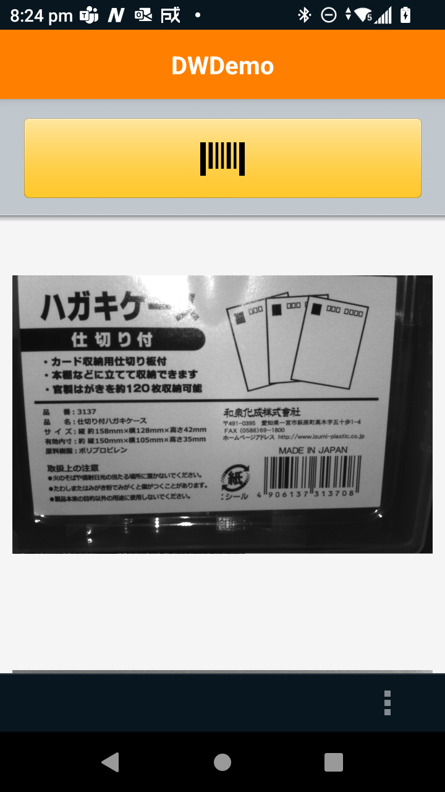

## Zebra-Android_Captrure Image via Barcode Scanner
## Zebra Android 内蔵スキャナで写真を撮る方法

UPDATED: 28 May 2024

### ■ 背景

Zebra Android 端末のスキャナで写真を撮りたいというご要望があります。その背景は大別すると下記の通りとなります。

- 利用端末にカメラが内蔵されていない
- ガンタイプオプション利用時に内蔵カメラを利用するのは非効率

  
### ■ 要望に対する回答

DataWedgeのFree-Form Image Capture機能の活用によって、ご要望を満たすことができるかもしれません。下記条件に合致するZebra Androidでは内蔵スキャナを用いて、画像を取得することができます。

- DataWedge 11.2 以上がインストールされている端末
    
    参考リンク：DataWedgeのバージョン確認方法
    https://supportcommunity.zebra.com/s/article/000020843?language=en_US

 

Free-Form Image Captureには下記制限があります。

1. スキャナで取得した画像はモノクロです。
2. 内蔵カメラと比較して解像度が控えめとなっていまます。

    参考動画：free-form image capture via the Imager
    https://www.youtube.com/watch?v=hwTDCuvcjYk

 

本機能の活用で下記の運用改善が見込めます。

1. カメラ非内蔵のZebra Androidでも現場写真の撮影が可能です。
2. スキャン＋写真撮影が必要な運用アクションの時短となります。

DataWedge(Free-Form Image Capture)はAPIが用意されているため、ご利用のアプリケーションへの実装は比較的容易です。

  
### ■ Free-Form Image Capture設定方法

Free-Form Image Captureは、新しいDataWedge入力プラグインである「Workflow」を介して提供されています。これは標準の「Barcode」入力プラグインとは別に存在します。
 

Free-Form Image Captureを設定するには、次の手順でDataWedgeプロファイルを設定します：
 

1. DataWedgeアプリを起動します。
2. 利用するプロファイルを選択。DataWedgeDemo利用時は[DataWedgeDemo]を選択します。
3. [Workflow Input] > [Enabled]を有効にします。DataWedgeはBarcodeとWorkflowの両方の入力プラグインを同時にアクティブにすることはできないことに注意してください。
4. [Free-Form Image Capture]を有効にします。
5. 詳細設定を表示するために[Free-Form Image Capture] > [...]を押します。
6. [Input Source] > [Imager]を選択します。
7. その他、必要な詳細設定があれば設定します。
 

   |||
   |-|-|
   | Session Timout | 処理のタイムアウト値
   | Illumination   | バックライト設定
   | Decode & Highlight Barcodes    | バーコード検知・読取設定

 

  

### ■ 機能確認・デモ方法

機能・動作検証やデモは下記アプリをご活用ください。

1. DataWedgeDemo
2. サンプルアプリ

参考情報

- Zebra Developers Blog: DataWedge Free-Form Image Capture
https://developer.zebra.com/blog/datawedge-free-form-image-capture
- New in DataWedge 11.2
  https://techdocs.zebra.com/datawedge/11-2/guide/versionhistory/#In%20Datawedge%2011.2
- Techdocs: Data Wedge 13.0 Sample Apps
https://techdocs.zebra.com/datawedge/DataWedge-jp/latest/guide/samples/